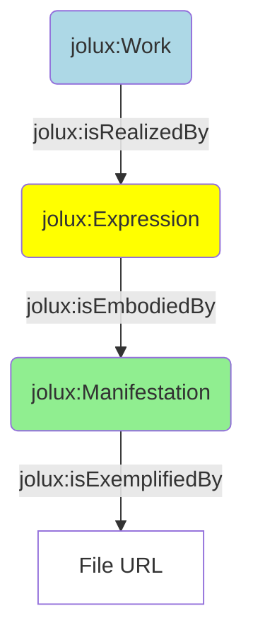

# Tutorial

This tutorial guides through the basics of the JOLux ontology using the federal constitution as an example.

## URI

The URI of the federal constitution is `https://fedlex.data.admin.ch/eli/oc/1999/404`. This URI has some important information encoded:

* the part `fedlex.data.admin.ch` is the namespace for all federal legislative information.
* `/eli` stands for [European Legislation Identifier](https://op.europa.eu/en/web/eu-vocabularies/eli) and is a effort to make legislation meta data available in a standardized format.
* the part `/oc` denotes the **Official Compilation**, meaning that this URI identifies something that is part of the official compilation of the federal law. The official compilation basically is the sum of the law.
* `/1999` is the year of the publication.
* `/404` is some random identifier that has no specific meaning (there is some irony in the federal constitutions having [HTTP 404 error](https://en.wikipedia.org/wiki/HTTP_404) as identifier).

This URI can be found on the website of [Fedlex](https://www.fedlex.admin.ch/) through a search. If this URI is put into a webbrowser, there is a redirection to https://www.fedlex.admin.ch/eli/oc/1999/404 but this is not the URI of the federal constitution but a website presenting the constitution with some additional meta data.

## Work, Expression, Manifestation

Let's examine the classes of the constitutions URI through the following SPARQL query:

```sparql
SELECT DISTINCT * WHERE {
	<https://fedlex.data.admin.ch/eli/oc/1999/404> a ?class.
}
```

The result shows, that the constitution is something of type `jolux:Work` (besides others). A `jolux:Work` is basically the abstract representation of a law text. Is there a connection to an `jolux:Expression`? Let's find out:

```sparql
PREFIX jolux: <http://data.legilux.public.lu/resource/ontology/jolux#>

SELECT DISTINCT * WHERE {
	<https://fedlex.data.admin.ch/eli/oc/1999/404> ?p ?o.
	?o a jolux:Expression.
}
```

So there are three `jolux:Expression`s connected via `jolux:isRealizedBy`:

* `https://fedlex.data.admin.ch/eli/oc/1999/404/de`
* `https://fedlex.data.admin.ch/eli/oc/1999/404/fr`
* `https://fedlex.data.admin.ch/eli/oc/1999/404/it`

So, a `jolux:Expression` is a **language specific** representation of a `jolux:Work`. The connection to the `jolux:Manifestation` for one expression is queried now:

```sparql
PREFIX jolux: <http://data.legilux.public.lu/resource/ontology/jolux#>

SELECT DISTINCT * WHERE {
	<https://fedlex.data.admin.ch/eli/oc/1999/404/de> ?p ?o.
	?o a jolux:Manifestation.
}
```

resulting in three `jolux:Manifestation`s connected via `jolux:isEmbodiedBy`:

* `https://fedlex.data.admin.ch/eli/oc/1999/404/de/doc`
* `https://fedlex.data.admin.ch/eli/oc/1999/404/de/pdf-a`
* `https://fedlex.data.admin.ch/eli/oc/1999/404/de/pdf-x`

This means that a `jolux:Manifestation` is a **language and file format specific** representation of a `jolux:Work`. If one wants to get e.g. the PDF document of the federal constitution in German, the following query helps:

```sparql
PREFIX jolux: <http://data.legilux.public.lu/resource/ontology/jolux#>

SELECT DISTINCT ?url WHERE {
  <https://fedlex.data.admin.ch/eli/oc/1999/404> jolux:isRealizedBy ?expression.
  ?expression jolux:language <http://publications.europa.eu/resource/authority/language/DEU>;
              jolux:isEmbodiedBy ?manifestation.
  ?manifestation jolux:userFormat <https://fedlex.data.admin.ch/vocabulary/user-format/pdf-a>;
                 jolux:isExemplifiedBy ?url.
}
```

So, the general connection between Work, Expression and Manifestation is shown in the following image:



