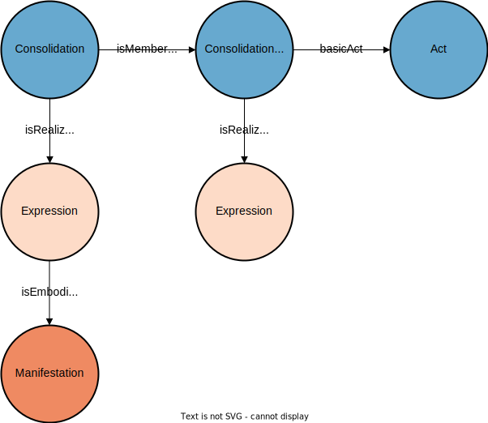

# Classified Compilation (CC)

The *classified compilation (CC)* (also known as systematic compilation) is according to the [lexicon of parliamentary terms](https://www.parlament.ch/en/%C3%BCber-das-parlament/parlamentsw%C3%B6rterbuch/parlamentsw%C3%B6rterbuch-detail?WordId=216) a regularly updated and revised collection of the law texts of the official compilation arranged under subject headings.

This part explains all the important objects that build an entry in the CC and it does so with the help of the federal constitution as an example of an entry in the CC.

## General Structure

Every entry in the CC is of type jolux:ConsolidationAbstract. It is a consolidation because it consolidates different entries from the OC into a single document that shows the current state. The term *abstract* is not so much meant as a summary but as an abstraction. At the same time, every jolux:ConsolidationAbstract is also a jolux:Work.

This jolux:ConsolidationAbstract has different versions to represent the state at different times. All these versions are connected to the jolux:ConsolidationAbstract through jolux:isMemberOf.

The following SPARQL query shows all the different versions of the federal constitution:

```sparql
PREFIX jolux: <http://data.legilux.public.lu/resource/ontology/jolux#>
SELECT * WHERE {
	?consolidation jolux:isMemberOf <https://fedlex.data.admin.ch/eli/cc/1999/404>.
}
```

These versions are in turn a jolux:Work with all the possibilities to extract information from the corresponding jolux:Expression and jolux:Manifestation. For example, the following SPARQL query gives the PDF link to the latest version of the constitution in English:

```sparql
PREFIX jolux: <http://data.legilux.public.lu/resource/ontology/jolux#>
SELECT * WHERE {
	?work jolux:isMemberOf <https://fedlex.data.admin.ch/eli/cc/1999/404>;
                jolux:dateApplicability ?date;
                jolux:isRealizedBy ?expression.
  ?expression jolux:language <http://publications.europa.eu/resource/authority/language/ENG>;
              jolux:isEmbodiedBy ?manifestation.
  ?manifestation jolux:format <http://publications.europa.eu/resource/authority/file-type/PDF>;
                 jolux:isExemplifiedBy ?url.
} ORDER BY DESC(?date)
LIMIT 1
```

The following figure shows the general structure of an entry in the CC:

:::{figure-md} cc_general


General structure of an entry in the Classified Compilation (CC).
:::

## URI

The URI of an entry in the CC contains the following parts:

* Standard namespace and path: `https://fedlex.data.admin.ch/eli/`
* the part `cc/` denotes the classified compilation, meaning that this URI identifies something that is part of the classified compilation of the federal law.
* `YYYY/` is the year of the publication.
* `ID` an identifier that has no specific meaning.

Example: The full URI of the federal constitution is `https://fedlex.data.admin.ch/eli/cc/1999/404`.

## Literals

| Property               | Type of Value  |
| ---------------------- | -------------- |
| jolux:eventTitle       | rdf:langString |
| jolux:eventId          | xsd:string     |
| jolux:eventDescription | rdf:langString |