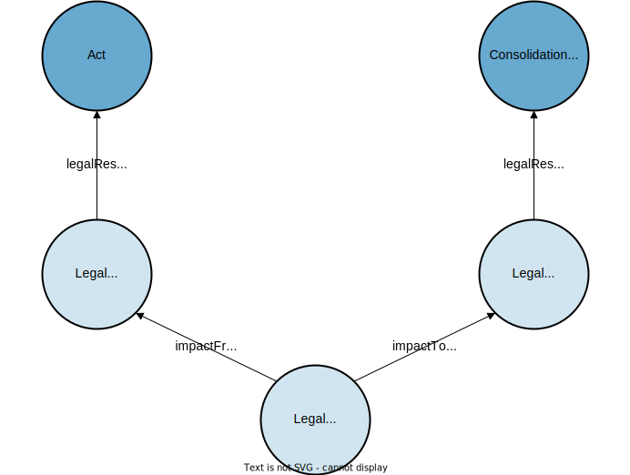

# Impacts

Impacts is what connect entries in the CC and OC. The entries in the CC are consolidations of entries in the **Official Compilation** (OC). This means that entries in the OC usually have an impact on entries in the CC.

Impacts are modelled as jolux:LegalResourceImpact.

:::{admonition} jolux:LegalResourceImpact
:class: note
:name: LegalResourceImpact
The owl:Class **jolux:LegalResourceImpact** is used to build an entry in the Classified Compilation out of different entries in the Official Compilation. Entries in the Official Compilation have impacts on entries in in the Classified Compilation. The jolux:LegalResourceImpact has two main predicates. jolux:impactFromLegalResource points to the source of the impact and jolux:impactToLegalResource points to the impacted resource.
:::

The following query shows all the entries in the OC, that have an impact on the federal constitution:

```sparql
PREFIX jolux: <http://data.legilux.public.lu/resource/ontology/jolux#>
SELECT DISTINCT ?act ?date WHERE {
  ?impact jolux:impactFromLegalResource/jolux:legalResourceSubdivisionIsPartOf ?act;
    jolux:impactToLegalResource/jolux:legalResourceSubdivisionIsPartOf <https://fedlex.data.admin.ch/eli/cc/1999/404>.
  ?act jolux:dateEntryInForce ?date.
} ORDER BY ?date
```

The following figure shows the connection between entries in the OC and CC trough jolux:LegalResourceImpact:

:::{figure-md} impact


Connection between entries in the Official Compilation and the Classified Compilation through impacts. 
:::