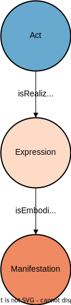

# Official Compilation (OC)

The *Official Compilation (CC)* is according to the [lexicon of parliamentary terms](https://www.parlament.ch/en/%C3%BCber-das-parlament/parlamentsw%C3%B6rterbuch/parlamentsw%C3%B6rterbuch-detail?WordId=11#q=official) the compilation of primarily the federal constitution, federal acts and federal decrees.

This part explains all the important objects that build an entry in the OC and it does so with the help of the federal constitution as an example of an entry in the OC.

## General Structure

Every entry in the OC is of type jolux:Act. At the same time, it is also a jolux:Work and therefore, jolux:Expression and jolux:Manifestation are available for all entries.

The following SPARQL query shows all the different jolux:Expression for the federal constitution:

```sparql
PREFIX jolux: <http://data.legilux.public.lu/resource/ontology/jolux#>
SELECT * WHERE {
    <https://fedlex.data.admin.ch/eli/oc/1999/404> jolux:isRealizedBy ?expression.
}
```

The following figure shows the general structure of an entry in the OC:

:::{figure-md} oc_general


General structure of an entry in the Official Compilation (CC).
:::

## URI

The URI of an entry in the OC contains the following parts:

* Standard namespace and path: `https://fedlex.data.admin.ch/eli/`
* the part `oc/` denotes the official compilation, meaning that this URI identifies something that is part of the official compilation of the federal law.
* `YYYY/` is the year of the publication.
* `ID` an identifier that has no specific meaning.

Example: The full URI of the federal constitution in the OC is `https://fedlex.data.admin.ch/eli/oc/1999/404`.